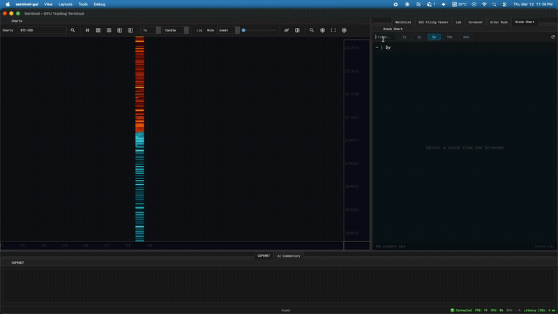
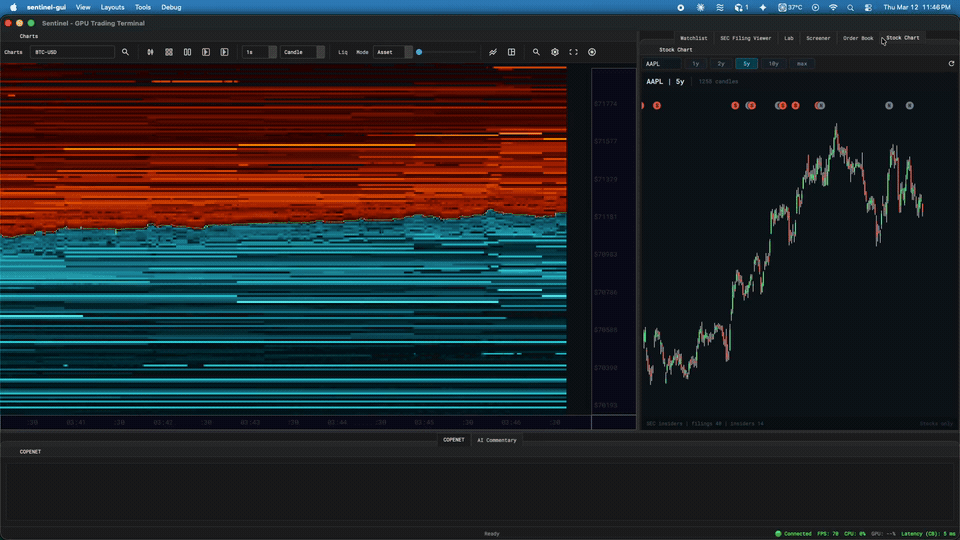
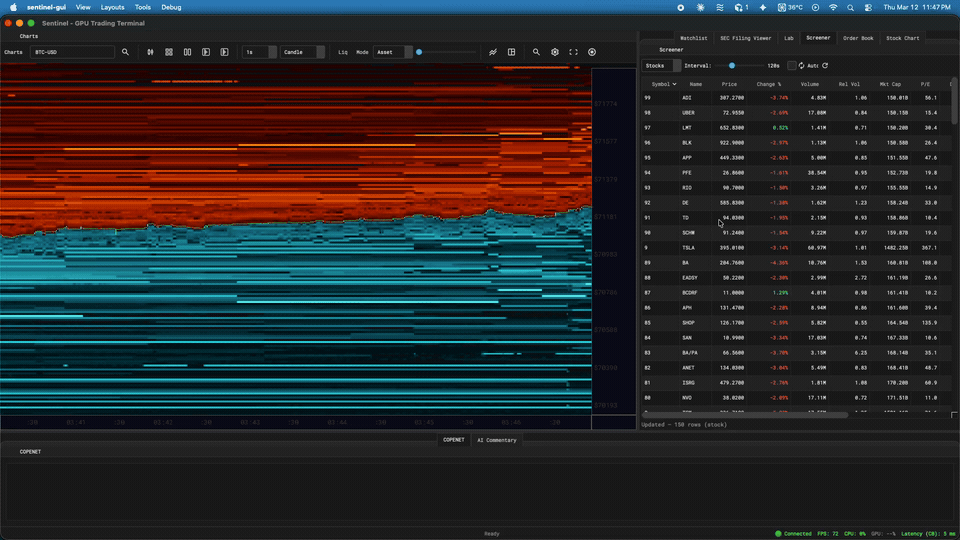

# Sentinel

High-performance **GPU-accelerated trading terminal** built with **C++20** and **Qt 6**.

A desktop workstation for visualizing market structure, order flow, and real-time data — powered by a custom rendering pipeline and a client/server architecture designed for speed.

<div align="center">
  
  
  
  
  
</div>

---

## Showcase

### GPU Heatmap Rendering

High-density order book visualization with real-time updates and smooth interaction.



---

### Stock Chart + SEC Insider Signals

Integrated equity charting with insider transaction overlays and contextual signals.



---

### Screener Workflow

Fast symbol discovery and routing into the charting system.



---

## Overview

Sentinel is built around a single constraint:

> dense market data should remain fluid, interactive, and interpretable under load

The system combines:

- GPU-first rendering (no per-frame allocations)
- Real-time streaming data pipelines
- Desktop workstation UI (Qt + QML + Scene Graph)
- Trading and simulation infrastructure

---

## Core Capabilities

### Rendering & Charting

- GPU-accelerated heatmap (single-quad texture sampling)
- ~110+ FPS during pan/zoom with live axis updates
- Zero-allocation axis rendering
- Candle, hollow, and line chart modes
- Consistent viewport mapping across overlays
- High-density grid support

---

### Market Tools

- Live heatmap chart
- Candle overlays aligned to heatmap mapping
- Stock chart workspace
- SEC insider signal overlays
- Watchlists with smart routing
- TradingView screener integration
- Order book / DOM ladder

---

### Trading & Simulation

- Paper trading infrastructure
- TP/SL bracket handling (server-backed)
- Replay and backtesting groundwork
- Shared simulation core
- Algo integration foundation

---

### Platform Architecture

- Client/server split
- Custom stream protocol
- TLS / WSS transport support
- Config-driven runtime
- Deterministic render/data flow

---

## Recent Platform Expansion

The latest integration introduced a major expansion across rendering, trading, and system architecture.

Highlights:

- Unified chart rendering architecture
- Major `UnifiedGridRenderer` refactor
- Paper trading + simulation vertical slice
- Stock chart + SEC overlays
- Watchlist, screener, and DOM improvements
- Transport security (TLS / WSS)

TPO, Footprint, and Volume Profile are implemented at a foundational level but remain disabled in the UI until complete.

---

## Quick Start

### Run a Release (recommended)

1. Download the latest **[release](https://github.com/pattty847/Sentinel-Trading-Terminal/releases)** artifact for your platform. Maintainers publish macOS archives from `./scripts/release_macos.sh` (under `dist/`; see **`docs/RELEASE_CHECKLIST.md`**) and Windows folders via **`scripts/release/windows-package-release.ps1`** (see **`scripts/release/README.md`**).
2. **macOS Zip:** unzip, then `./run.sh` from that folder. This starts **`SentinelServer.app`** plus **`Sentinel.app`** (`SENTINEL_QML_PATH` is set by the launcher). **Windows package:** **`run.cmd`** from the unpacked folder (**`scripts/release/README.md`**).

   No API keys are required for **live Coinbase public** market data (`BTC-USD` is configured by default).

3. Pick a Coinbase spot symbol and stream from the GUI (magnifying glass / symbol entry) — the fastest demo path is the **public** websocket (no signup).

Automated sanity for a staged folder (maintainers): `./scripts/smoke_macos.sh`

**See it in motion:** Showcase GIFs are in **[Showcase](#showcase)** below (heatmap, stock chart + SEC insiders, screener).

**After launch — what should work**

| Item | Notes |
|------|--------|
| Server starts | `./run.sh` or `scripts/smoke_macos.sh`; health pings `127.0.0.1` (default HTTP health port configurable via **`SENTINEL_HEALTH_PORT`**) |
| GUI window opens | If it does not, check TLS certs and `resources/certs/ca-bundle.crt` |
| Coinbase spot stream | Public symbols (**no credentials**) — subscribe in client |
| Python-backed features | SEC overlays, candle fetch via `uv`-managed `scripts/` — run **`brew install uv`**, **`(cd scripts && uv sync)`** inside the unpacked folder if overlays fail |

Maintainers: reproducible bundles from source use **`cmake --preset mac-clang-release`**, **`./scripts/release_macos.sh`** (see **`scripts/release/README.md`**).

---

### Build from Source

#### Windows

```powershell
setx QT_MSVC C:\Qt\6.9.3\msvc2022_64
setx VCPKG_ROOT C:\dev\vcpkg

git clone https://github.com/pattty847/Sentinel.git
cd Sentinel
cmake --preset windows-msvc
cmake --build --preset windows-msvc -j
```

Run:

```powershell
build/windows-msvc/apps/sentinel-gui/Release/sentinel-gui.exe
```

---

#### macOS

```bash
brew install qt cmake ninja
export QT_MAC=/opt/homebrew/opt/qt
export VCPKG_ROOT=$HOME/vcpkg

git clone https://github.com/pattty847/Sentinel.git
cd Sentinel
cmake --preset mac-clang
cmake --build --preset mac-clang -j
```

---

#### Linux

```bash
sudo apt install build-essential cmake ninja-build qt6-base-dev qt6-declarative-dev
export QT_LINUX=/usr/lib/qt6
export VCPKG_ROOT=$HOME/vcpkg

git clone https://github.com/pattty847/Sentinel.git
cd Sentinel
cmake --preset linux-gcc
cmake --build --preset linux-gcc -j
```

---

## Run (from source build tree)

CMake uses output name **`sentinel-gui`** and **`sentinel-server`** under **`build/<preset>/apps/sentinel-gui/<Config>/`** and **`apps/sentinel-server/<Config>/`** (exact path depends on platform and preset). Adjust paths accordingly — example:

```bash
./build/linux-gcc/apps/sentinel-server/Release/sentinel-server
./build/linux-gcc/apps/sentinel-gui/Release/sentinel-gui
```

Start **server before client**, from the repository root.

The stream server uses TLS with a per-machine self-signed pair that is never committed. Generate it once before the first run:

```bash
bash certs/gen-certs.sh
```

(Windows: `certs/gen-certs.ps1`.) Without it the server logs `SentinelStreamServer start failed` and clients cannot connect.

For **macOS bundles** produced off this repo see **`scripts/release_macos.sh`** and **`LAUNCH_README.md`** bundled with releases.

---

## Configuration

```bash
cp config/server_config.yaml config/.server_config.yaml
cp config/client_config.yaml config/.client_config.yaml
```

Example:

```yaml
heatmap:
  timeframe: 1000
  grid_width: 2048
  grid_height: 1024

server:
  default_symbols: BTC-USD

gui:
  api_port: 17100
```

---

## Architecture

```
libs/core/    Data layer (protocol, market data, simulation)
libs/gui/     Qt rendering + UI system
apps/         Client, server, tools
```

Single authoritative viewport shared across all rendering layers.

---

## License

AGPL-3.0