# Sentinel C++: GPU Architecture Overview

```mermaid
graph TD
    subgraph "WebSocket Thread"
        WS["Coinbase WebSocket API"] --> CORE[("MarketDataCore<br>🌐 WebSocket Framing & Parsing")];
        CORE -- "Snapshot  V& L2 Updates" --> LOB[("LiveOrderBook<br>📚 Stateful In-Memory Book")];
        CORE -- "Trade Matches" --> ADAPTER[("GPUDataAdapter<br>🌉 Bridge to GUI Thread")];
        LOB -- "Book State" --> ADAPTER;
    end

    subgraph "Lock-Free Data Pipeline (Zero-Malloc)"
        ADAPTER -- "Push to Queues" --> TRADES_Q[("LockFreeQueue<br>Trade Objects")];
        ADAPTER -- "Push to Queues" --> BOOK_Q[("LockFreeQueue<br>OrderBook Objects")];
    end

    subgraph "GUI Thread (Qt)"
        subgraph "Data Processing (Batching)"
            PROC_TIMER["QTimer (e.g., 16ms)"] --> |"Triggers"| BATCH_PROC[("GPUDataAdapter::processIncomingData<br>Drain Queues & Convert")];
            TRADES_Q --> |"Pop"| BATCH_PROC;
            BOOK_Q --> |"Pop"| BATCH_PROC;
        end

        subgraph "GPU Rendering (Qt Scene Graph)"
            GPU_CHART[("GPUChartWidget<br>📈 VBO Triple Buffering<br>Pan/Zoom Transforms<br>🎯 Master Coordinates")];
            HEATMAP[("HeatmapInstanced<br>🔥 Instanced Rendering<br>Order Book Depth")];
            CANDLES[("CandlestickBatched<br>🕯️ Multi-Timeframe OHLC<br>Progressive LOD System")];
        end

        BATCH_PROC -- "tradesReady(points, count)" --> GPU_CHART;
        BATCH_PROC -- "heatmapReady(quads, count)" --> HEATMAP;
        BATCH_PROC -- "candlesReady(ohlc, count)" --> CANDLES;

        subgraph "Coordinate Synchronization"
            GPU_CHART -- "viewChanged(time, price)" --> HEATMAP;
            GPU_CHART -- "viewChanged(time, price)" --> CANDLES;
        end
    end

    subgraph "GPU Hardware"
        GPU_CHART -- "Uploads VBO" --> GPU[("GPU<br>Batched Draw Calls")];
        HEATMAP -- "Uploads Instance Data" --> GPU;
        CANDLES -- "Uploads OHLC Geometry" --> GPU;
    end

    style LOB fill:#4ECDC4,stroke:#333,stroke-width:3px
    style ADAPTER fill:#f9d71c,stroke:#333,stroke-width:2px
    style TRADES_Q fill:#FF6B6B,stroke:#333,stroke-width:2px
    style BOOK_Q fill:#FF6B6B,stroke:#333,stroke-width:2px
    style GPU_CHART fill:#45B7D1,stroke:#333,stroke-width:3px
    style HEATMAP fill:#96CEB4,stroke:#333,stroke-width:3px
    style CANDLES fill:#FFA07A,stroke:#333,stroke-width:3px
```

This document provides a high-level overview of the Sentinel C++ application's **GPU-centric architecture**, designed for ultra-high-performance financial data visualization.

## 🚀 **Architectural Vision: The GPU Revolution**

Sentinel has undergone a fundamental architectural transformation, moving away from CPU-based rendering to a direct-to-GPU pipeline. The new architecture is built on three core pillars designed to visualize dense, stateful market data in real-time with zero-contention and minimal latency.

1.  **Stateful, Dense Order Book:** We now maintain a complete, live replica of the order book in memory, enabling the visualization of a dense "wall of liquidity" instead of sparse, individual updates.
2.  **Lock-Free, Zero-Malloc Data Pipeline:** A high-throughput, non-blocking pipeline connects the WebSocket processing thread directly to the GUI rendering thread, eliminating contention and memory allocation on the hot path.
3.  **Multi-Layer, Direct-to-GPU Rendering:** The CPU-bound `QPainter` is gone. All rendering is now performed directly on the GPU using Qt's Scene Graph, with three specialized components for different data types: trade scatter plots, order book heatmaps, and multi-timeframe candlestick charts, all leveraging VBOs and instanced rendering for maximum performance.

## The New Data Flow: From Socket to Pixel

The architecture is designed to minimize latency and contention at every stage. Data flows from the network to the GPU in a carefully orchestrated, multi-threaded pipeline.

### The Worker (WebSocket) Thread
-   **Responsibilities:** Handles all network I/O, parses WebSocket messages, and maintains the live order book state.
-   **Key Classes:**
    -   **`MarketDataCore`**: Manages the Boost.Beast WebSocket connection and parses incoming JSON messages (trades, L2 updates, snapshots).
    -   **`LiveOrderBook`**: The crown jewel of our state management. It consumes L2 update messages to maintain a complete, sorted, in-memory representation of the bids and asks. This provides the "stateful" view of the market.
    -   **`GPUDataAdapter`**: Acts as the bridge. It's called by `MarketDataCore` on the worker thread to push new `Trade` and `OrderBook` objects into high-performance, lock-free queues.

### The Lock-Free Pipeline
-   **Responsibilities:** Decouples the worker thread from the GUI thread, allowing the worker to process data at maximum speed without ever waiting for the renderer.
-   **Key Components:**
    -   **`LockFreeQueue`**: A template-based, single-producer, single-consumer (SPSC) queue. It uses atomic operations to enqueue and dequeue data without locks, making it perfect for cross-thread communication. We use two instances: one for trades and one for the full order book state.

### The Main (GUI) Thread
-   **Responsibilities:** Manages the UI, processes user input, and orchestrates all GPU rendering.
-   **Key Classes:**
    -   **`GPUDataAdapter`**: On the GUI thread, a `QTimer` periodically triggers `processIncomingData()`. This method drains the lock-free queues, transforms the raw data into GPU-optimized vertex structures, and emits signals (`tradesReady`, `heatmapReady`, `candlesReady`) with pointers to large, pre-allocated buffers. This "batching" approach is critical for performance.
    -   **`GPUChartWidget`**: Renders tens of thousands of trade points. It uses **VBO triple-buffering** to update the GPU's memory without stalling the render loop. It is also the master of the coordinate system, handling all pan/zoom logic.
    -   **`HeatmapInstanced`**: Renders the dense order book. It uses **instanced rendering** to draw thousands of quads (representing price levels) in a single, efficient draw call. It listens for signals from `GPUChartWidget` to keep its coordinate system perfectly synchronized.
    -   **`CandlestickBatched`**: Renders multi-timeframe OHLC candlestick charts with intelligent Level-of-Detail (LOD) switching. It progressively builds candles from trade data, automatically selects optimal timeframes based on zoom level, and synchronizes coordinates with the master chart widget for seamless multi-layer visualization.

## Architectural Pillars in Detail

### 1. Stateful Order Book Visualization
-   **Why:** Traditional charting often shows sparse, stateless events (e.g., the last trade price). To understand market depth, we must see the entire "wall of liquidity"—every bid and ask currently on the book.
-   **How:** The `LiveOrderBook` class subscribes to the `l2update` channel. It first initializes its state from a `snapshot` message. Then, it applies every subsequent `l2update` message to its internal `std::map` of bids and asks. This gives us a complete, live picture of the order book at any moment, ready to be rendered as a dense heatmap.

### 2. The Lock-Free, Zero-Malloc Pipeline
-   **Why:** In a high-frequency system, locks are a primary source of performance bottlenecks and unpredictable latency (jitter). Furthermore, frequent memory allocations (`new`, `malloc`) on the data hot-path can lead to heap contention and fragmentation.
-   **How:**
    -   **`LockFreeQueue`** ensures the WebSocket thread can push data without ever being blocked by the GUI thread.
    -   The `GPUDataAdapter` pre-allocates large `std::vector` buffers for GPU data (`m_tradeBuffer`, `m_heatmapBuffer`). When processing incoming data, it simply fills these buffers and passes pointers. There are **zero allocations** in the `processIncomingData` loop, resulting in a highly predictable, low-latency pipeline.

### 3. Multi-Layer, Direct-to-GPU Rendering
-   **Why:** To render tens of thousands of data points at 60+ FPS, CPU-based tools like `QPainter` are not viable. We must communicate with the GPU in its native language: buffers of vertex data and batched draw calls.
-   **How:** We use Qt's Scene Graph, a retained-mode graphics API that sits on top of OpenGL/Metal/Vulkan.
    -   **`GPUChartWidget`** uses Vertex Buffer Objects (VBOs). It maintains three buffers; while one is being rendered, another can be filled with new data from the `GPUDataAdapter`. This avoids stalls and visual tearing.
    -   **`HeatmapInstanced`** uses a technique where a single base shape (a quad) is defined once, and the GPU is instructed to draw it thousands of times in a single call, each with a different position, size, and color. This is the most efficient method for rendering massive amounts of similar objects.
    -   **`CandlestickBatched`** renders OHLC candles with separate geometry for bullish/bearish candles and wicks. It uses intelligent LOD switching to automatically select optimal timeframes (1sec to Daily) based on zoom level, ensuring candles remain visually meaningful at all scales while maintaining 60+ FPS performance.

## The Multi-Timeframe Candlestick System

The candlestick rendering system represents one of the most sophisticated components in Sentinel's GPU architecture, designed specifically for professional cryptocurrency trading where sub-second precision and multi-timeframe analysis are critical.

### Progressive Candle Building
-   **Real-time Aggregation:** Unlike traditional charting systems that pre-compute candles, Sentinel builds OHLC candles progressively from live trade data. Each incoming trade updates the current candle's high, low, close, and volume in real-time.
-   **Multiple Timeframes:** The system maintains six concurrent timeframe buckets:
    -   **1 Second:** Ultra-high frequency for scalping (minimum timeframe for crypto)
    -   **1 Minute:** Standard intraday analysis
    -   **5 Minutes:** Short-term trend analysis
    -   **15 Minutes:** Medium-term patterns
    -   **1 Hour:** Hourly support/resistance levels
    -   **Daily:** Long-term trend analysis
-   **Bucket Alignment:** Candles are timestamp-aligned to their respective timeframe boundaries (e.g., 1-minute candles start at :00 seconds, hourly candles at :00 minutes).

### Intelligent Level-of-Detail (LOD) System
-   **Automatic Timeframe Selection:** The system calculates pixels-per-candle based on the current zoom level and automatically selects the optimal timeframe to maintain visual clarity.
-   **LOD Thresholds:**
    -   `< 2 pixels/candle`: Daily candles
    -   `< 5 pixels/candle`: 60-minute candles  
    -   `< 10 pixels/candle`: 15-minute candles
    -   `< 20 pixels/candle`: 5-minute candles
    -   `< 40 pixels/candle`: 1-minute candles
    -   `≥ 40 pixels/candle`: 1-second candles
-   **Smooth Transitions:** LOD changes are seamless, with the geometry buffer automatically rebuilding when zoom levels cross thresholds.

### Micro-View Optimization
-   **Sub-10-Second Hiding:** When zoomed to extremely tight timeframes (< 10 seconds visible), candles are automatically hidden to prevent visual noise. At this scale, individual trade dots and order book heatmap provide superior detail.
-   **Minimum Visibility:** Candles are guaranteed a minimum 2-pixel width to prevent disappearance during low-volume periods.

### GPU Rendering Architecture
-   **Dual Geometry Approach:** Separate rendering passes for bullish (green) and bearish (red) candles, allowing for independent material properties and optimized batching.
-   **Body + Wick Separation:** Candle bodies use triangle-based quads for filled rectangles, while wicks use line-based geometry for thin vertical lines.
-   **Volume Scaling:** Optional volume-based width scaling where candle width reflects trading volume intensity.
-   **Coordinate Follower:** Synchronizes with `GPUChartWidget` master coordinates via `viewChanged` signals, ensuring perfect alignment with trade dots and heatmap layers.

### Performance Characteristics
-   **Batched Updates:** Integrates with `GPUDataAdapter`'s 16ms batching cycle via `candlesReady` signals, avoiding individual trade processing overhead.
-   **Memory Efficiency:** Pre-allocated vertex buffers with capacity management to prevent runtime allocations.
-   **Render Throttling:** Geometry updates only when view coordinates change or new data arrives, maintaining 60+ FPS even with thousands of visible candles.

### Professional Trading Features
-   **Bullish/Bearish Color Coding:** Instant visual recognition of price direction with configurable color schemes.
-   **OHLC Precision:** Maintains full precision for open, high, low, close values critical for technical analysis.
-   **Time Synchronization:** Perfect alignment with trade execution timestamps for accurate backtesting and strategy development.

## The Pan/Zoom Coordinate System
Responsiveness during user interaction is critical. The pan and zoom system is designed for a fluid experience without compromising rendering performance.

-   **World vs. Screen Coordinates:** The `GPUChartWidget` acts as the single source of truth for the viewing window. It maintains a "world" coordinate system based on time (X-axis) and price (Y-axis). A transformation function (`worldToScreen`) converts these abstract coordinates into pixel coordinates for rendering.
-   **User Input:** The `mousePressEvent`, `mouseMoveEvent`, and `wheelEvent` are overridden to capture user input. These events modify the transformation parameters (e.g., `m_zoomFactor`, `m_panOffsetX`).
-   **Throttling & Synchronization:**
    - During rapid mouse drags or wheel scrolls, updates are throttled to avoid overwhelming the render thread.
    - Crucially, whenever the view changes, `GPUChartWidget` emits a `viewChanged` signal containing the new time and price range.
    - Both `HeatmapInstanced` and `CandlestickBatched` connect to this signal. This ensures that all three rendering layers (trade scatter, order book heatmap, and OHLC candles) are **always rendered in the same coordinate space**, providing a seamless, unified visualization.

## Build System & Dependencies
-   **CMake:** The cross-platform build system generator.
-   **Qt6:** Used for the application framework, GUI thread event loop, and the Scene Graph rendering API.
-   **Boost.Beast:** Powers the underlying WebSocket networking.
-   **vcpkg:** Manages all C++ dependencies. 