# Sentinel: GPU-Centric Architecture for High-Frequency Visualization

**Version**: 2.0
**Author**: C++ Architect
**Status**: Live Document

## Table of Contents
1.  [**Architectural Vision**](#-architectural-vision-the-zero-latency-gpu-pipeline)
2.  [**System Diagram**](#-system-diagram)
3.  [**Data Flow: From Socket to Pixel**](#-the-data-flow-from-socket-to-pixel)
    -   [The Worker (WebSocket) Thread](#the-worker-websocket-thread)
    -   [The Lock-Free SPSC Pipeline](#the-lock-free-spsc-pipeline)
    -   [The Main (GUI) Thread](#the-main-gui-thread)
4.  [**Architectural Pillars in Detail**](#-architectural-pillars-in-detail)
    -   [Stateful, High-Frequency Order Book](#1-stateful-high-frequency-order-book)
    -   [The Lock-Free, Zero-Malloc Pipeline](#2-the-lock-free-zero-malloc-pipeline)
    -   [Multi-Layer, Direct-to-GPU Rendering](#3-multi-layer-direct-to-gpu-rendering)
5.  [**Core Component Deep Dive**](#-core-component-deep-dive)
    -   [`core/MarketDataCore`](#coremarketdatacore)
    -   [`core/LiveOrderBook`](#coreliveorderbook)
    -   [`gui/GPUDataAdapter`](#guigpudataadapter)
    -   [`gui/GPUChartWidget`](#guigpuchartwidget)
    -   [`gui/HeatmapInstanced`](#guiheatmapinstanced)
    -   [`gui/CandlestickBatched`](#guicandlestickbatched)
6.  [**Identified Inefficiencies & Optimization Opportunities**](#-identified-inefficiencies--optimization-opportunities)
7.  [**Roadmap & Future Enhancements**](#-roadmap--future-enhancements)
    -   [Dynamic LOD for Order Book Visualization](#dynamic-lod-for-order-book-visualization)
    -   [Integrated Performance Monitoring](#integrated-performance-monitoring)
    -   [Configuration-Driven System](#configuration-driven-system)
    -   [Rule Engine Offloading](#rule-engine-offloading)

---

## 🚀 **Architectural Vision: The Zero-Latency GPU Pipeline**

This document outlines the architecture of Sentinel, a high-performance trading terminal engineered to visualize dense, high-frequency market data with near-zero latency. The design philosophy is a complete departure from traditional CPU-bound charting, embracing a direct-to-GPU pipeline that is purpose-built for the demands of a Bookmap-style visualization.

The architecture is founded on three pillars designed to process and render full order book snapshots at a target of **100ms intervals** while maintaining a fluid 60+ FPS user experience:

1.  **Stateful, High-Frequency Order Book:** We maintain a complete, live in-memory replica of the order book, processing full snapshots to visualize the market's "wall of liquidity" rather than sparse, incremental updates.
2.  **Lock-Free, Zero-Malloc Data Pipeline:** A high-throughput, single-producer, single-consumer (SPSC) queueing system connects the networking thread directly to the GUI rendering thread. This eliminates lock contention and heap allocations on the critical data path, ensuring predictable, low-latency data delivery.
3.  **Multi-Layer, Direct-to-GPU Rendering:** All rendering is performed directly on the GPU using Qt's Scene Graph. The system employs three specialized, hardware-accelerated rendering components: a trade scatter plot, an instanced order book heatmap, and batched multi-timeframe candlestick charts. These layers are synchronized to a master coordinate system, providing a unified, composite view of the market.

## 📈 System Diagram

```mermaid
graph TD
    subgraph "Worker Thread (Network & Data Processing)"
        WS["Coinbase WebSocket API"] -->|Raw JSON| CORE[("MarketDataCore<br>Connection & Parsing")];
        CORE -- "100ms Snapshots & Trades" --> LOB[("LiveOrderBook<br>📚 In-Memory State")];
        LOB -- "Prepared Data Blocks" --> ADAPTER_WORKER[("GPUDataAdapter (Worker Side)<br>🌉 Bridge to GUI Thread")];
    end

    subgraph "Lock-Free Data Pipeline (SPSC)"
        ADAPTER_WORKER -- "push(trades)" --> TRADES_Q[("LockFreeQueue<br>Trade Data")];
        ADAPTER_WORKER -- "push(book_state)" --> BOOK_Q[("LockFreeQueue<br>Order Book Data")];
    end

    subgraph "GUI Thread (Qt)"
        subgraph "Batching & GPU Buffer Preparation"
            PROC_TIMER["QTimer (16ms)"] --> |Triggers| ADAPTER_GUI[("GPUDataAdapter::processIncomingData<br>Drain Queues & Fill VBOs")];
            TRADES_Q --> |"pop"| ADAPTER_GUI;
            BOOK_Q --> |"pop"| ADAPTER_GUI;
        end

        subgraph "GPU Rendering Components (Qt Scene Graph)"
            GPU_CHART[("GPUChartWidget<br>📈 Master Coordinates<br>VBO Triple Buffering<br>Trade Scatter Plot")];
            HEATMAP[("HeatmapInstanced<br>🔥 Instanced Rendering<br>Order Book Depth")];
            CANDLES[("CandlestickBatched<br>🕯️ Multi-Timeframe OHLC<br>Batched Geometry")];
        end

        ADAPTER_GUI -- "tradesReady(buffer)" --> GPU_CHART;
        ADAPTER_GUI -- "heatmapReady(buffer)" --> HEATMAP;
        ADAPTER_GUI -- "candlesReady(buffer)" --> CANDLES;

        subgraph "Coordinate Synchronization"
            GPU_CHART -- "viewChanged(timeRange, priceRange)" --> HEATMAP;
            GPU_CHART -- "viewChanged(timeRange, priceRange)" --> CANDLES;
        end
    end

    style LOB fill:#4ECDC4,stroke:#333,stroke-width:3px
    style ADAPTER_WORKER fill:#f9d71c,stroke:#333,stroke-width:2px
    style ADAPTER_GUI fill:#f9d71c,stroke:#333,stroke-width:2px
    style TRADES_Q fill:#FF6B6B,stroke:#333,stroke-width:2px
    style BOOK_Q fill:#FF6B6B,stroke:#333,stroke-width:2px
    style GPU_CHART fill:#45B7D1,stroke:#333,stroke-width:3px
    style HEATMAP fill:#96CEB4,stroke:#333,stroke-width:3px
    style CANDLES fill:#FFA07A,stroke:#333,stroke-width:3px
```

## 🔁 The Data Flow: From Socket to Pixel

The architecture is designed to minimize latency and contention at every stage. Data flows from the network to the GPU in a carefully orchestrated, multi-threaded pipeline.

### The Worker (WebSocket) Thread
-   **Responsibilities:** Handles all network I/O via Boost.Beast, parses incoming WebSocket JSON messages, maintains the live order book state, and hands off prepared data to the GUI thread.
-   **Key Classes:**
    -   **`MarketDataCore`**: Manages the WebSocket connection, authentication (`Authenticator`), and message parsing. It acts as the entry point for all market data.
    -   **`LiveOrderBook`**: Consumes snapshot and trade messages from `MarketDataCore`. It maintains a complete, sorted, in-memory representation of bids and asks, providing the stateful view of the market required for heatmap visualization.
    -   **`GPUDataAdapter` (Worker Side)**: This part of the adapter is called by `LiveOrderBook` on the worker thread. Its sole job is to push `Trade` and `OrderBook` data structures into high-performance, lock-free queues.

### The Lock-Free SPSC Pipeline
-   **Responsibilities:** Decouples the worker thread from the GUI thread, allowing the worker to process data at maximum speed without ever waiting for the renderer. This is the core of the low-latency design.
-   **Key Component:**
    -   **`LockFreeQueue`**: A template-based, single-producer, single-consumer (SPSC) queue that uses atomic operations for thread-safe enqueuing and dequeuing without locks. We use two instances: one for trades and one for the full order book state.

### The Main (GUI) Thread
-   **Responsibilities:** Manages the UI, processes user input, and orchestrates all GPU rendering via the Qt Scene Graph.
-   **Key Classes:**
    -   **`GPUDataAdapter` (GUI Side)**: A `QTimer` (e.g., set to 16ms for ~60 FPS) periodically triggers `processIncomingData()`. This method drains the lock-free queues, transforms the raw data directly into GPU-optimized vertex structures inside pre-allocated buffers, and emits signals (`tradesReady`, `heatmapReady`, `candlesReady`) with pointers to this data. This batching approach is critical for performance.
    -   **`GPUChartWidget`**: The master rendering component. It renders trades as a scatter plot and controls the master coordinate system (time and price). It handles all pan/zoom logic and emits `viewChanged` signals to synchronize other chart layers. It should use VBO triple-buffering for non-blocking GPU memory updates.
    -   **`HeatmapInstanced`**: Renders the dense order book heatmap. It uses **instanced rendering** to draw thousands of quads (representing price/volume levels) in a single draw call, which is exceptionally efficient. It is a "slave" to `GPUChartWidget`, listening for `viewChanged` signals to keep its view perfectly synchronized.
    -   **`CandlestickBatched`**: Renders OHLC candles. It progressively builds candles from incoming trades and uses batched geometry to draw all visible candles efficiently. It also synchronizes its coordinate system with `GPUChartWidget`.

## 🏛️ Architectural Pillars in Detail

### 1. Stateful, High-Frequency Order Book
-   **Why:** To visualize market depth as a heatmap, we need the entire "wall of liquidity"—every bid and ask—not just the latest trade. Processing full 100ms snapshots provides a complete, time-stamped view of the market state.
-   **How:** The `LiveOrderBook` class is designed for this. Upon receiving a snapshot message from `MarketDataCore`, it should completely replace its internal state. The data structure used to hold the book (e.g., `std::map` or a sorted `std::vector`) is critical for performance. The entire state is then passed to the `GPUDataAdapter` for visualization.

### 2. The Lock-Free, Zero-Malloc Pipeline
-   **Why:** In a high-frequency system, locks are a primary source of unpredictable latency (jitter). Frequent memory allocations (`new`, `malloc`) on the data hot-path lead to heap contention and fragmentation. This pipeline architecture eliminates both.
-   **How:**
    -   **`LockFreeQueue`** (`lockfreequeue.h`) guarantees that the worker thread can push data without ever being blocked by the GUI thread, which might be busy rendering or processing user input.
    -   **`GPUDataAdapter`** pre-allocates large `std::vector` buffers for GPU vertex data. When `processIncomingData()` is called, it drains the queues and fills these existing buffers. **Zero dynamic memory allocations should occur in this loop.** It passes pointers or offsets into these buffers, ensuring a highly predictable, low-latency pipeline.

### 3. Multi-Layer, Direct-to-GPU Rendering
-   **Why:** To render tens of thousands of data points at 60+ FPS, CPU-based tools like `QPainter` are not an option. We must communicate with the GPU in its native language: buffers of vertex data and minimal, batched draw calls.
-   **How:** We use Qt's Scene Graph, a retained-mode graphics API that sits on top of the native graphics driver (OpenGL/Metal/Vulkan).
    -   **`HeatmapInstanced`**: Instanced rendering is the key here. We define a single quad geometry once. Then, for each price level in the order book, we send a small packet of instance data (position, color, size) to the GPU. The GPU then draws all quads in a single, highly optimized draw call.
    -   **`GPUChartWidget`**: For the trade scatter plot, it should use a dynamically updated Vertex Buffer Object (VBO). To avoid stalling the render loop while waiting for GPU memory transfers, a triple-buffering technique is recommended: one buffer is being rendered, a second is ready to be rendered, and a third is being filled with new data.
    -   **`CandlestickBatched`**: This component builds geometry for all visible candles into a single buffer and draws them in one or a few batched calls, separating by color (e.g., bullish/bearish) for efficiency.

## 🧩 Core Component Deep Dive

### `core/MarketDataCore`
-   **Responsibility**: The application's sole entry point for market data. Manages WebSocket lifecycle, handles authentication via `Authenticator`, and parses incoming JSON messages into C++ data structures.
-   **Interaction**: Receives raw data from the network and forwards structured data (trades, snapshots) to `LiveOrderBook`.

### `core/LiveOrderBook`
-   **Responsibility**: Maintains the in-memory, stateful representation of the order book.
-   **Critical Implementation**: Uses `std::map` for O(log N) price level management with thread-safe access via mutex. It processes full snapshots and incremental updates to maintain a complete view of market depth for professional visualization.

### `gui/GPUDataAdapter`
-   **Responsibility**: The critical bridge between the worker and GUI threads. It embodies the "batching" principle of the architecture.
-   **Hot Path Method**: `processIncomingData()`. This function must be ruthlessly optimized. It should drain the `LockFreeQueue`s, iterate through the raw data, and write vertex data directly into pre-allocated GPU buffers. **No memory allocation, no complex logic, no blocking calls.** It finishes by emitting signals with pointers/handles to the ready-to-render GPU data.

### `gui/GPUChartWidget`
-   **Responsibility**: The master of the visual scene. Renders the trade scatter plot and defines the canonical coordinate system for time and price.
-   **Key Functions**: Handles all mouse/wheel events for panning and zooming. Emits the `viewChanged(timeRange, priceRange)` signal whenever the view transforms, which is the heartbeat for synchronizing all other visual layers.

### `gui/HeatmapInstanced`
-   **Responsibility**: Visualizes order book depth using hardware-accelerated instanced rendering.
-   **Mechanism**: Contains a `QSGGeometryNode` with a base geometry (one quad). It listens for `heatmapReady` from the adapter. The data from the adapter is used to update an instance buffer on the GPU. On the `viewChanged` signal from `GPUChartWidget`, it updates its transformation matrix to scroll and scale in lockstep with the master chart.

### `gui/CandlestickBatched`
-   **Responsibility**: Renders OHLC candles.
-   **Mechanism**: Aggregates trades into time buckets (1s, 1m, etc.). Uses `candlelod` to determine the appropriate level of detail based on zoom. Builds meshes for all visible candles into a single VBO and renders them in batches. Also a slave to `GPUChartWidget`'s coordinate system.

---

## ⚠️ **Identified Inefficiencies & Optimization Opportunities**

Given the AI-assisted development and goal of ultra-low latency, the following areas warrant immediate review and potential refactoring.

1.  **`LiveOrderBook` Container Choice**:
    -   **Issue**: The current `LiveOrderBook` uses `std::map` which provides O(log N) operations but may not be optimal for high-frequency snapshot processing.
    -   **Recommendation**: For snapshot processing, consider using `std::vector` with `std::sort` for better cache locality and reduced memory allocation overhead.

2.  **Data Copies in the Pipeline**:
    -   **Issue**: Data structures for trades and order books might be passed by value between `MarketDataCore`, `LiveOrderBook`, and `GPUDataAdapter`, causing unnecessary copies.
    -   **Recommendation**: Use `std::unique_ptr` or `std::move` to transfer ownership of data objects through the pipeline on the worker thread. The final `push` into the `LockFreeQueue` should also move the object.

3.  **"Zero-Malloc" Verification**:
    -   **Issue**: The `processIncomingData` loop in `GPUDataAdapter` is the most critical path on the GUI side. Any hidden memory allocation (e.g., `std::vector` resizing without `reserve`, `QString` manipulations) will introduce jitter and kill performance.
    -   **Recommendation**: Use a memory profiler (like Heaptrack) or override `operator new` to strictly verify there are **zero** allocations on this path. Ensure all buffers are pre-allocated to a sufficient max size at startup.

4.  **GUI Timer Precision**:
    -   **Issue**: `QTimer` is not a real-time timer and can have its precision limited by the OS, especially under load. A 16ms timer might fire at 20ms or later, causing choppy visuals.
    -   **Recommendation**: For Windows, consider using `timeBeginPeriod` to request higher scheduler precision. On all platforms, use a `QElapsedTimer` to measure the actual time since the last frame and pass this `dt` to the animation/update logic to ensure smooth transformations, even if the frame rate fluctuates.

5.  **Business Logic on the Hot Path**:
    -   **Issue**: The project contains a `ruleengine` and `statisticsprocessor`. If this logic is executed synchronously within the `MarketDataCore` or `LiveOrderBook`, it will add significant latency to the critical path.
    -   **Recommendation**: This logic must be moved to a separate, lower-priority thread. The core pipeline's only job is to get data from the socket to the GPU. Business logic and statistical analysis should consume data from a separate fan-out queue.

---

## 🗺️ **Roadmap & Future Enhancements**

### Dynamic LOD for Order Book Visualization
This is the next logical step for a high-performance Bookmap replica.
-   **Phase 1: Aggregation in `LiveOrderBook`**:
    -   Extend `LiveOrderBook` to maintain multiple aggregated views of the order book (e.g., raw 100ms, 1-second average, 5-second average).
    -   The aggregator would run after a new snapshot is processed, updating the coarser timeframes.
-   **Phase 2: LOD Selection Logic**:
    -   In `GPUChartWidget`, calculate the time range currently visible on screen.
    -   Based on this duration, select an appropriate LOD level (e.g., < 10s view -> 100ms data; 10s-60s view -> 1s data).
-   **Phase 3: Pipeline Integration**:
    -   The `GPUDataAdapter` needs a new method, e.g., `setLODLevel()`.
    -   `GPUChartWidget` calls this method when the zoom level crosses a threshold.
    -   `GPUDataAdapter` then requests data from the corresponding aggregated view in `LiveOrderBook`. This may require separate lock-free queues for each LOD level or a more dynamic data request mechanism.

### Integrated Performance Monitoring
-   **Concept**: Leverage the existing `performancemonitor` to create a real-time diagnostics overlay.
-   **Implementation**: Add timestamps at each stage of the pipeline:
    1.  `MarketDataCore` (data received)
    2.  `LiveOrderBook` (book built)
    3.  `GPUDataAdapter` (pushed to queue)
    4.  `GPUDataAdapter` (popped from queue)
    5.  `GPUDataAdapter` (GPU buffer ready)
    -   Display these latencies (e.g., `T5 - T1`) in a small, toggleable overlay in the GUI to allow developers to instantly spot bottlenecks.

### Configuration-Driven System
-   **Issue**: Many parameters (timer intervals, LOD thresholds, colors, API keys) are likely hardcoded.
-   **Recommendation**: Implement a simple JSON or INI-based configuration file that is loaded at startup. This improves maintainability and allows for quick experimentation without recompiling.

### Rule Engine Offloading
-   **Concept**: Ensure the complex event processing of `ruleengine` and `statisticsprocessor` never impacts visualization latency.
-   **Architecture**: `LiveOrderBook` should push data into two separate queues: the high-priority `LockFreeQueue` for the GUI and a secondary, standard `std::queue` (with a mutex) for the rules engine, which runs on its own dedicated thread. This decouples business logic from the rendering pipeline completely. 