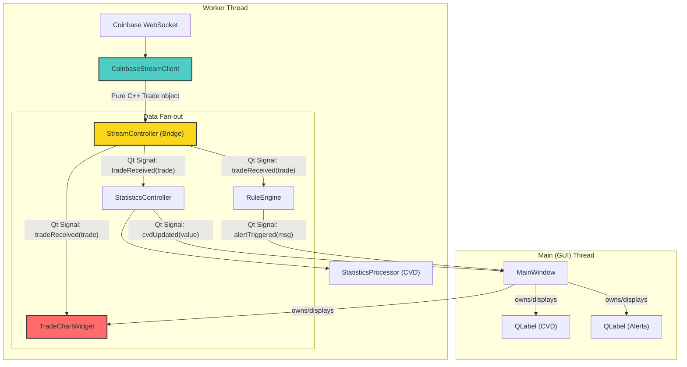

# Sentinel C++: Architecture Overview

This document provides a high-level overview of the Sentinel C++ application's architecture, design principles, and data flow. It is intended to be a guide for developers working on the codebase.

## The North Star: The Vision for Sentinel

The ultimate goal of Sentinel is to be a professional-grade, high-performance market microstructure analysis tool, beginning with the BTC-USD pair on Coinbase and expand from there. The vision extends beyond a simple desktop application to a robust, 24/7 analysis engine.

The core principles are:
1.  **High Performance:** The application must be able to process high-frequency data streams (both trades and order book updates) without lagging or freezing. The C++/Qt stack was chosen specifically for this purpose.
2.  **Modularity:** The core analysis logic should be completely decoupled from the user interface. This allows the "engine" to be potentially compiled as a library, run as a headless daemon, or exposed as a microservice in the future.
3.  **Rich Visualization:** The UI should evolve beyond simple text readouts to include rich, graphical visualizations of market data, such as order book heatmaps, inspired by professional trading tools like aterm.

## Current Architecture: A Two-Thread Model

Sentinel is built on a multi-threaded architecture to ensure the user interface remains responsive at all times.

### The Main (GUI) Thread
-   **Responsibilities:** Manages and renders all UI elements. Handles user input (mouse clicks, keyboard entry).
-   **Key Class:** `MainWindow`. It is the root of the UI and acts as the coordinator that sets up the worker thread and orchestrates the creation of all other objects.

### The Worker Thread
-   **Responsibilities:** Handles all blocking operations and heavy computation. This includes all networking, data parsing, and statistical calculations.
-   **Key Classes:**
    -   `WebSocketClient`: Manages the connection to the Coinbase WebSocket API, receives raw data, and parses it into structured `Trade` objects.
    -   `RuleEngine`: Manages a collection of `Rule` objects and evaluates them against incoming data.
    -   `StatisticsController`: A Qt-based wrapper that owns the pure C++ `StatisticsProcessor`.
    -   `StatisticsProcessor`: A pure C++ class responsible for calculating the Cumulative Volume Delta (CVD).

### The "Controller" Pattern & Data Flow
The key to our architecture is the **Controller Pattern**. Our core logic (like `StatisticsProcessor`) is written in pure, standard C++, making it independent and reusable. However, to integrate with Qt's threading and signal/slot system, we wrap it in a "Controller" (`StatisticsController`).

The data flows as follows:
1.  `WebSocketClient` receives data and emits a Qt signal (`tradeReady`).
2.  This signal is received by slots in `RuleEngine` and `StatisticsController` (within the worker thread).
3.  `StatisticsController` passes the data to the pure C++ `StatisticsProcessor`.
4.  When the processor has a new CVD value, it invokes a standard C++ callback.
5.  The callback is implemented inside `StatisticsController`, which then emits a new Qt signal (`cvdUpdated`).
6.  This signal is safely sent across the thread boundary to a slot in `MainWindow`, which updates the UI.

## The Journey So Far: A Phased Approach
1.  **Phase 1: Setup & OO Refactoring:** Migrated from a single-file script to a clean, object-oriented design.
2.  **Phase 2: Logic Core:** Implemented the `RuleEngine` and `StatisticsProcessor` for CVD.
3.  **Phase 3: Multithreading:** Moved all networking and processing to a background `QThread`.
4.  **Phase 4: Decoupling:** Refactored core logic to be independent of Qt, introducing the "Controller" pattern.
5.  **Phase 5: High-Performance Streaming Rewrite:** Replaced the basic WebSocket client with the production-grade `CoinbaseStreamClient`.
6.  **Phase 6: Bridge Integration:** Integrated the C++ engine with Qt using the `StreamController` bridge pattern.
7.  **Phase 7: Real-Time Charting:** Implemented the custom-drawn `TradeChartWidget` with live price-line, trade-flow dots, and dynamic axes.

### 🔥 Phase 7 Accomplishments: Real-Time Charting Engine

**Problem Solved:** How to visualize high-frequency trade data in real-time without using slow, pre-packaged chart libraries.

**What We Built:**
- **`TradeChartWidget`:** A fully custom `QWidget` that takes complete control of the rendering process.
- **Dynamic Scaling:** The chart automatically calculates the min/max of the current data window and scales the axes accordingly.
- **Price and Time Axes:** We now draw proper Y-axis (price) and X-axis (time) labels with grid lines for context.
- **Multi-layered Drawing:**
  - ✅ **Layer 1:** Black background and faint grid.
  - ✅ **Layer 2:** A continuous white line representing the price action.
  - ✅ **Layer 3:** Red/Green dots overlaid at each data point to show aggressive buy/sell flow.
- **Symbol Filtering:** The chart is now "symbol-aware" and correctly filters to display only `BTC-USD`, solving the scaling problem.

**Architecture Pattern:**
- **Direct Signal-to-Slot Connection:** The `StreamController`'s `tradeReceived` signal is piped directly to the `TradeChartWidget`'s `addTrade` slot, making the data flow incredibly efficient.
- **`QPainter` Mastery:** All rendering is done using `QPainter`, giving us pixel-perfect control over the final output.

**Integration Results:**
- **The "Good Squigglies":** We have a beautiful, real-time chart showing live market microstructure.
- **Readable & Contextual:** The addition of axes makes the chart instantly understandable.
- **High Performance:** The custom widget can handle the high-frequency data stream with ease.

**🚀 NEXT PHASE: Advanced Visualizations & UI Polish**
- **Phase 8:** Order Book Heatmaps - The next major step toward our `aterm` goal.
- **Phase 9:** UI/UX Polish - Add zoom/pan controls, a proper status bar, and improved aesthetics.
- **Phase 10:** Performance Optimization - Explore OpenGL rendering for even greater speed.

## The Build System
-   **CMake:** The cross-platform build system generator. `CMakeLists.txt` is our master blueprint.
-   **make:** The build tool that executes the blueprint generated by CMake.
-   **moc (Meta-Object Compiler):** A Qt tool that reads `Q_OBJECT` classes and generates necessary C++ source code to enable signals, slots, and other Qt features. These generated files are placed in the `build/sentinel_autogen` directory and compiled along with your own code. 