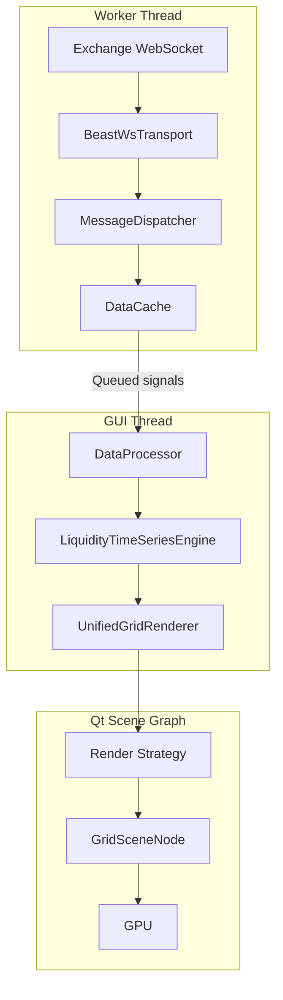

# Sentinel Architecture

**Version**: 2.1  
**Status**: Active Development

Sentinel delivers a GPU-accelerated trading terminal built on modern C++20 with Qt 6. The architecture is designed to stream exchange data with low latency, aggregate it into a dense time/price grid, and render it interactively while remaining modular enough for headless or CLI workflows.

---

## 1. Architectural Principles

- **Layered Ownership**: `libs/core` owns networking, domain logic, and data stores; `libs/gui` adapts that data to Qt/QML; `apps/` bootstrap executables only.
- **Performance First**: Hot paths avoid allocations, copies, or blocking calls. A 500-line soft cap keeps modules approachable for refactors.
- **Deterministic Threads**: Network IO runs on dedicated workers, GUI mutations occur via queued signals on the main thread, and lock-free queues bridge the two.
- **Modularity**: Transport, dispatcher, cache, aggregation, and render layers sit behind clear seams so new providers or visualizations slot in without upheaval.
- **Observability**: `SentinelLogging` channels (`sentinel.app|data|render|debug`) and performance monitors provide visibility across the stack.

---

## 2. Layered Layout

```
apps/
  ├─ sentinel_gui/      # Desktop entry point
  └─ stream_cli/        # Headless data harness

libs/
  ├─ core/
  │   └─ marketdata/
  │        ├─ ws/ (BeastWsTransport, SubscriptionManager)
  │        ├─ dispatch/ (MessageDispatcher, event types)
  │        ├─ cache/ (DataCache, DataCacheSinkAdapter)
  │        ├─ auth/ (Authenticator)
  │        └─ model/ (Trade, OrderBook, LiveOrderBook DTOs)
  └─ gui/
       ├─ UnifiedGridRenderer (QML façade)
       ├─ GridViewState (viewport state)
       ├─ render/ (DataProcessor, LiquidityTimeSeriesEngine, strategies)
       └─ qml/ (scene components)

scripts/              # Tooling and analysis helpers
tests/marketdata/     # Active GoogleTest suites
```

Only `QtCore` is permitted in `libs/core`. All UI code remains in `libs/gui`, and executables never house business logic.

---

## 3. Data Pipeline (Exchange → GPU)



1. **Transport (`marketdata/ws`)** establishes TLS connections, heartbeats, and reconnection backoff via `BeastWsTransport`. `SubscriptionManager` generates deterministic subscribe/unsubscribe frames.
2. **Dispatch (`marketdata/dispatch`)** parses raw frames into typed events using `MessageDispatcher`, surfacing provider acks or errors alongside trade/book payloads.
3. **Cache (`marketdata/cache`)** stores rolling trades and live order book snapshots. `DataCacheSinkAdapter` exposes the only write API so other layers stay decoupled.
4. **Aggregation (`libs/gui/render`)**: `DataProcessor` pulls from the cache when new data arrives, funnels it into `LiquidityTimeSeriesEngine`, and prepares multi-timeframe grid slices.
5. **Rendering (`libs/gui`)**: `UnifiedGridRenderer` bridges QML, `GridViewState`, and the active render strategy (heatmap, trade flow, etc.). Strategies build GPU buffers that `GridSceneNode` submits through the Qt Scene Graph.

Thread boundaries are explicit: the transport/dispatcher work never blocks the GUI, and GUI updates defer to queued lambdas guarded by `QPointer` to avoid dangling captures.

---

## 4. Rendering Architecture

Sentinel’s renderer is intentionally modular so adding a visualization does not disturb the façade.

- **UnifiedGridRenderer**: Exposes properties and signals to QML, forwards input events, and schedules scene graph updates. Contains no business logic.
- **GridViewState**: Tracks pan, zoom, selection, and axis ranges. All interaction logic routes through it for consistent behavior.
- **Render Strategies (`render/strategies`)**: Each strategy implements geometry generation for a visualization mode. Strategies receive pre-aggregated cells and return `QSGNode` updates.
- **GridSceneNode**: Owns GPU buffers, applies viewport transforms, and orchestrates child nodes for overlays and indicators.
- **QML & Controls**: Declaratively compose the window, axis components, tool panels, and wire user actions back into C++ controllers.

---

## 5. Testing & Quality Gates

- GoogleTest suites under `tests/marketdata` cover transports, dispatch, and subscription logic. As new subsystems come online, add suites beside the relevant domain.
- Smoke-test the GUI manually after changes that touch rendering or threading boundaries.
- No pull request ships without a clean `cmake --build --preset <preset>` and `ctest --preset <preset> --output-on-failure` run.
- Hot-path modifications should include notes on performance impact and, where possible, benchmark evidence.

---

## 6. Tooling & Observability

- **Logging**: Configure `QT_LOGGING_RULES` to enable or suppress `sentinel.*` categories. See `docs/LOGGING_GUIDE.md` for examples.
- **Analysis Scripts**: `scripts/quick_cpp_overview.sh` and `scripts/extract_functions.sh` provide structure and function lists for large files prior to refactors.
- **Monitoring**: `SentinelMonitor` exposes unified render/data metrics and replaces prior ad-hoc profilers. Activate it for profiling sessions instead of console prints.

---

## 7. Related Documentation

- `docs/sockets-auth-cache-refactor.md`: phased plan for the MarketDataCore decomposition and future modularization steps.
- `docs/LOGGING_GUIDE.md`: logging categories, verbosity controls, and best practices.
- `README.md`: platform-specific setup instructions, build presets, and prerequisite tooling.

Stay within these architectural boundaries, keep hot paths lean, and favor modular seams when adding new capability.
