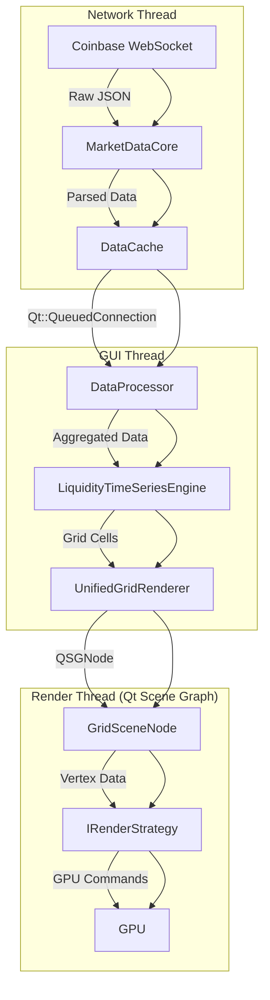

# Sentinel Architecture

**Version**: 2.0  
**Status**: Production

## 1. Core Principles

The Sentinel architecture is designed for performance, modularity, and maintainability.

- **Separation of Concerns**: The codebase is strictly divided into three layers:
    - `libs/core/`: Pure, non-GUI C++ business logic. The only Qt dependency allowed is `QtCore`.
    - `libs/gui/`: Qt/QML adapter layer. Connects the UI to the core logic but contains no business logic itself.
    - `apps/`: The main application entry point, responsible for initialization.
- **Modularity**: Functionality is broken down into small, single-responsibility components.
- **Strict File Size Limits**: Files are kept under 300 lines of code to enforce modularity and prevent monolithic classes.
- **Modern C++**: The project uses C++20 features like concepts, ranges, and smart pointers for robust, memory-safe code.
- **Strategy Pattern**: Pluggable `IRenderStrategy` components allow for adding new visualization modes (e.g., Heatmap, Trade Flow) without changing the core rendering pipeline.

## 2. Data Pipeline: WebSocket to GPU

The system uses a high-performance, multi-threaded pipeline to process real-time data from the WebSocket API and render it on the GPU.

**Pipeline Stages:**

1.  **Data Ingestion (Network Thread)**: `MarketDataCore` connects to the Coinbase WebSocket, authenticates, and asynchronously receives market data. It parses the incoming JSON and stores it in the `DataCache`.
2.  **Processing (GUI Thread)**: The `DataProcessor` is notified of new data via a thread-safe Qt signal. It fetches the data and feeds it into the `LiquidityTimeSeriesEngine`.
3.  **Aggregation**: The `LiquidityTimeSeriesEngine` aggregates the raw order book snapshots into multiple timeframes (100ms, 500ms, 1s, etc.), creating time/price grid cells.
4.  **Rendering (Render Thread)**: The `UnifiedGridRenderer` takes the aggregated grid cells and, using the currently selected `IRenderStrategy`, generates the necessary geometry. This geometry is passed to the `GridSceneNode`, which manages the Qt Scene Graph nodes and efficiently sends rendering commands to the GPU.

## 3. Rendering Architecture

The rendering system is a modular, strategy-based design. A monolithic `UnifiedGridRenderer` was refactored into a set of cooperating components.

### Component Breakdown

-   **`UnifiedGridRenderer` (The Slim Adapter)**
    -   **Role**: A thin QML-to-C++ bridge.
    -   **Responsibilities**: Exposes properties to QML, routes UI events (mouse, keyboard) to the appropriate components, and selects the active rendering strategy. It contains **no business logic**.

-   **`GridViewState` (The State Manager)**
    -   **Role**: The single source of truth for all UI state.
    -   **Responsibilities**: Manages the viewport's time/price range, zoom level, and pan offset. It handles all user interaction logic for smooth, sensitivity-controlled navigation.

-   **`DataProcessor` (The Data Hub)**
    -   **Role**: Orchestrates incoming data for the rendering pipeline.
    -   **Responsibilities**: Receives data from the `core` library, feeds it to the `LiquidityTimeSeriesEngine`, and signals the renderer when new data is ready.

-   **`IRenderStrategy` (The Strategy Interface)**
    -   **Role**: An interface for pluggable visualization modes.
    -   **Responsibilities**: Defines a contract for rendering different types of data. Concrete implementations like `HeatmapStrategy`, `TradeFlowStrategy`, and `CandleStrategy` encapsulate the specific logic for generating GPU geometry for that mode.

-   **`GridSceneNode` (The GPU Interface)**
    -   **Role**: A custom `QSGNode` that manages the scene graph.
    -   **Responsibilities**: Applies viewport transformations (pan/zoom), updates GPU vertex buffers with geometry from the current strategy, and manages other visual elements like the volume profile.

-   **`AxisModel` Family (The QML Data Models)**
    -   **Role**: Provides data for the QML-based price and time axes.
    -   **Responsibilities**: `TimeAxisModel` and `PriceAxisModel` are `QAbstractListModel` implementations that dynamically generate axis labels and tick marks based on the `GridViewState`'s current viewport.

### UI Interaction Flow (Pan & Zoom)

User interactions like panning and zooming are designed for a smooth, "buttery" feel.

1.  **Event**: A `QWheelEvent` (for zooming) or `QMouseEvent` (for panning) is captured in the `UnifiedGridRenderer`.
2.  **Delegation**: The event is immediately passed to the `GridViewState`.
3.  **State Update**: `GridViewState` updates its internal state (e.g., zoom factor, pan offset). It uses sensitivity controls and clamping to prevent jarring jumps. For panning, it provides an immediate visual offset for real-time feedback before committing the change.
4.  **Signal**: `GridViewState` emits a signal indicating the viewport has changed.
5.  **Re-render**: The `UnifiedGridRenderer` catches this signal and schedules a scene graph update. The `GridSceneNode` then applies the new transformation matrix, resulting in a smooth visual update.

This ensures that the UI remains responsive and fluid, as expensive geometry regeneration is decoupled from simple viewport transformations.
