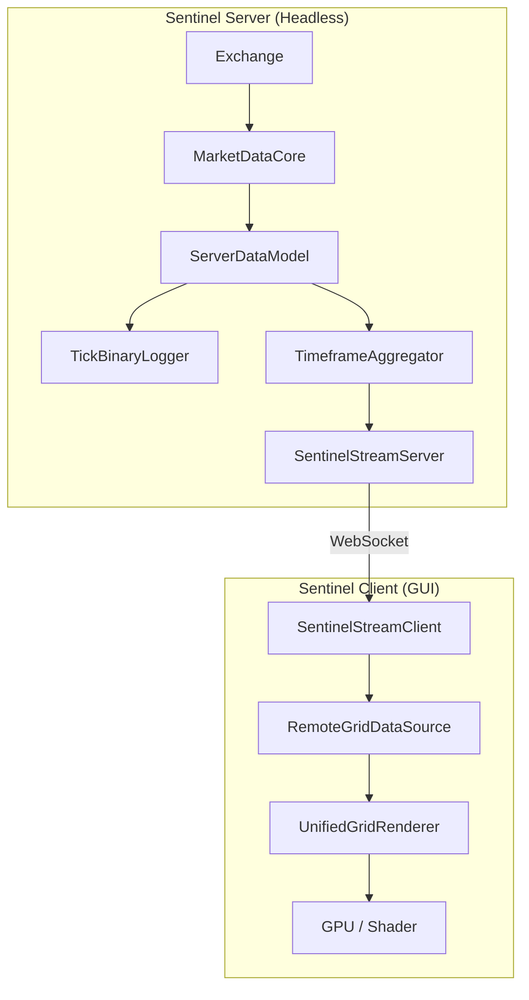

# Sentinel Architecture

**Version**: 3.0  
**Status**: Active Development (Distributed Phase)

Sentinel is a high-performance, GPU-resident trading terminal. It has been re-engineered from a monolithic application into a mandatory **Client-Server** architecture to ensure 24/7 data ingestion, persistence, and scalable visualization.

---

## 1. Architectural Principles

- **Pure Client-Server**: Ingestion and visualization are decoupled. The server runs as a headless daemon; the client is a lightweight visualizer.
- **GPU-Resident Rendering**: Legacy CPU-per-cell rendering loops have been gutted. All high-density visualizations (Heatmaps, TradeFlow) are shaded directly on the GPU using streamed intensity textures.
- **Zero-Copy Data Plane**: Hot paths utilize binary streams and pre-aggregated buffers to minimize overhead between the server and the GPU.
- **Deterministic Threads**: Network IO (Boost.Beast), aggregation, and rendering occur on dedicated threads.

---

## 2. Layered Layout

```
apps/
  ├─ sentinel_gui/      # Visualization client (Remote-only)
  └─ sentinel-server/   # Headless data & persistence daemon

libs/
  ├─ core/
  │   ├─ marketdata/    # Exchange transports
  │   ├─ protocol/      # Client-Server WebSocket protocol
  │   ├─ servermodel/   # Server state, aggregation, and persistence
  │   └─ model/         # Shared DTOs
  └─ gui/
       ├─ UnifiedGridRenderer (GPU pipeline orchestration)
       ├─ datasources/   # RemoteGridDataSource
       ├─ render/        # GPU-resident strategies (Heatmap, etc.)
       └─ qml/           # UI components
```

Only `QtCore` is permitted in `libs/core`. All rendering logic resides in `libs/gui` as GPU shaders and strategies.

---

## 3. Data Pipeline (Distributed)


```mermaid
graph TD
    subgraph "Sentinel Server (Headless)"
        A[Exchange] --> B[MarketDataCore]
        B --> C[ServerDataModel]
        C --> D[TickBinaryLogger]
        C --> E[TimeframeAggregator]
        E --> F[SentinelStreamServer]
    end

    subgraph "Sentinel Client (GUI)"
        F -->|WebSocket| G[SentinelStreamClient]
        G --> H[RemoteGridDataSource]
        H --> I[UnifiedGridRenderer]
        I --> J[GPU / Shader]
    end
```

1. **Ingestion**: `sentinel-server` maintains the primary connection to exchanges.
2. **Persistence**: `TickBinaryLogger` rotates raw data hourly; `TimeframeAggregator` maintains the history segments.
3. **Streaming**: `SentinelStreamServer` broadcasts pre-aggregated slices (e.g., 100ms TWAP columns) to clients.
4. **Rendering**: `UnifiedGridRenderer` uploads these columns directly to GPU textures, allowing for smooth 60 FPS performance even with 67M+ active cells.

---

## 4. Rendering Architecture (GPU-Only)

- **Heatmap Strategy**: Renders as a single GPU quad. The server streams intensity data into 16-bit textures. Viewport logic is handled via shader uniforms (Time/Price offsets).
- **Performance**: Capable of 8192x8192 (67M) cells today, with 10k x 10k planned.

---

## 5. Testing & Quality Gates

- **Protocol Verification**: Ensures snapshot and incremental updates maintain consistency.
- **Render Stress**: GUI must maintain frame rate at extreme zoom levels and high texture density.

---

## 6. Related Documentation

- `docs/CLIENT-SERVER.md`: Protocol implementation details.
- `docs/refactors/heatmap/heatmap_plan.md`: Evolution of the GPU heatmap.
- `docs/LOGGING_GUIDE.md`: Observability best practices.

