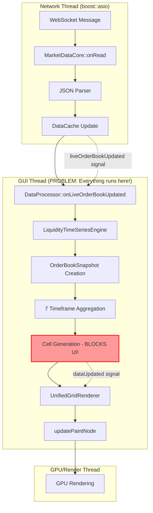

# Sentinel Data Flow: From WebSocket to GPU (CORRECTED)

This document outlines the **actual** end-to-end data flow for the Sentinel application, correcting previous inaccuracies and highlighting critical issues discovered during code analysis.

## 🚨 CRITICAL ISSUES IDENTIFIED

### 1. **BLOCKING UI THREAD** - Primary Performance Problem
- `UnifiedGridRenderer::updateVisibleCells()` calls `DataProcessor::updateVisibleCells()` **synchronously**
- This blocks the GUI thread waiting for cell generation
- **Result**: UI freezes, can't maintain 60 FPS

### 2. **QTimer Remnants** - Legacy Pollution  
- `DataProcessor` still has `QTimer` code (disabled but present)
- Comments claim "signal-driven" but timer infrastructure remains
- **Confusion**: Mixed paradigms in codebase

### 3. **Double Coordinate Transformation** - Geometry Bug
- Cells converted to screen coordinates in `DataProcessor`
- Then transformed again in GPU pipeline
- **Result**: Geometry pushed off-screen, visual artifacts

### 4. **Thread Architecture Mismatch**
- Explanation claims `DataProcessor` runs on dedicated thread
- **Reality**: Lives on main thread, no thread separation implemented

## ⛓️ ACTUAL Data Pipeline (Corrected)



---

## 🔍 Detailed Step-by-Step Breakdown (ACTUAL IMPLEMENTATION)

### Stage 1: Data Ingestion (Network Thread) ✅ CORRECT

1. **Component**: `MarketDataCore`
2. **Thread**: Dedicated Network I/O Thread (boost::asio strand)
3. **Process**:
   ```cpp
   void MarketDataCore::onRead(beast::error_code ec, std::size_t) {
       std::string payload = beast::buffers_to_string(m_buf.data());
       auto message = nlohmann::json::parse(payload);
       dispatch(message);  // Calls handleOrderBookUpdate
   }
   ```
   - WebSocket receives JSON messages
   - `dispatch()` routes to `handleOrderBookUpdate()` 
   - Updates `DataCache` with incremental order book changes
   - **Signal Emission** (thread-safe):
   ```cpp
   QMetaObject::invokeMethod(this, [this, productId]() {
       emit liveOrderBookUpdated(productId);
   }, Qt::QueuedConnection);
   ```

### Stage 2: Data Processing (⚠️ WRONG THREAD - GUI THREAD!)

1. **Component**: `DataProcessor`  
2. **Thread**: **GUI Thread** (NOT dedicated worker thread as claimed!)
3. **Process**:
   ```cpp
   void DataProcessor::onLiveOrderBookUpdated(const QString& productId) {
       // Fetch dense order book from cache
       const auto& book = m_dataCache->getDirectLiveOrderBook(productId);
       // Feed to LTSE - THIS BLOCKS THE UI THREAD!
       m_liquidityEngine->addOrderBookSnapshot(book);
       // Generate cells synchronously - MORE UI BLOCKING!
       updateVisibleCells();
   }
   ```

### Stage 3: Time Series Aggregation (LTSE) - ⚠️ BLOCKS UI

1. **Component**: `LiquidityTimeSeriesEngine`
2. **Thread**: GUI Thread (the problem!)
3. **Process**:
   ```cpp
   void LiquidityTimeSeriesEngine::addOrderBookSnapshot(const OrderBook& book) {
       // Convert to internal snapshot format
       OrderBookSnapshot snapshot;
       // Update ALL 7 timeframes simultaneously  
       updateAllTimeframes(snapshot);  // CPU-intensive on UI thread!
   }
   ```
   - Creates `OrderBookSnapshot` from dense order book
   - **Simultaneously updates 7 timeframes**: 100ms, 250ms, 500ms, 1s, 2s, 5s, 10s
   - Each timeframe aggregates liquidity into `LiquidityTimeSlice` objects
   - **Price quantization**: Rounds prices to configured resolution

### Stage 4: Cell Generation (🚨 THE MAIN PROBLEM)

1. **Component**: `DataProcessor::updateVisibleCells()`
2. **Thread**: GUI Thread (should be background!)
3. **Process**:
   ```cpp
   void DataProcessor::updateVisibleCells() {
       // This call BLOCKS the UI thread!
       auto visibleSlices = m_liquidityEngine->getVisibleSlices(timeStart, timeEnd, minPrice, maxPrice);
       
       m_visibleCells.clear();  // Nuclear cache invalidation
       
       for (const auto& slice : visibleSlices) {
           createCellsFromLiquiditySlice(slice);  // More blocking work
       }
       
       emit dataUpdated();  // Finally signal completion
   }
   ```

### Stage 5: Rendering (GUI Thread to GPU)

1. **Component**: `UnifiedGridRenderer`
2. **Thread**: GUI Thread → Qt Scene Graph Render Thread
3. **Process**:
   ```cpp
   QSGNode* UnifiedGridRenderer::updatePaintNodeV2(QSGNode* oldNode) {
       if (m_geometryDirty.load()) {
           updateVisibleCells();  // SYNCHRONOUS CALL - BLOCKS UI!
           
           GridSliceBatch batch{m_visibleCells, ...};
           sceneNode->updateContent(batch, strategy);
       }
   }
   ```

## 🎯 PYTHON ANALOGY (What We Actually Have vs. What We Want)

### Current Broken Architecture:
```python
# BAD: Everything on main thread
def main_ui_loop():
    while True:
        # WebSocket data arrives
        order_book = websocket.get_latest()
        
        # UI THREAD BLOCKS HERE - FREEZES APP!
        cells = process_data_blocking(order_book)  # Takes 50ms+
        
        # Can't maintain 60fps due to blocking
        render_frame(cells)
        time.sleep(1/60)  # Target 60fps but can't achieve it
```

### Target V2 Architecture:  
```python
# GOOD: Background processing
def main_ui_loop():
    while True:
        # Always have latest data ready (never blocks)
        cells = get_latest_cells_nonblocking()
        render_frame(cells)  # Always smooth
        time.sleep(1/60)  # Steady 60fps

def background_worker():
    while True:
        if websocket.has_data():
            order_book = websocket.get_latest()
            cells = process_data(order_book)  # Background thread
            atomic_update_cells(cells)  # Non-blocking update
```

## 🔧 KEY INSIGHTS FROM CODE ANALYSIS

### ✅ What's Working Well:
1. **WebSocket Processing**: Real-time, event-driven, proper threading
2. **LTSE Architecture**: 7 parallel timeframes, good aggregation logic  
3. **Signal/Slot Connections**: Thread-safe Qt::QueuedConnection
4. **GPU Rendering**: Qt Scene Graph handles GPU efficiently

### 🚨 What's Broken:
1. **Threading Model**: DataProcessor should be on worker thread, isn't
2. **Blocking Operations**: Cell generation blocks UI thread
3. **Cache Strategy**: Nuclear invalidation instead of incremental updates
4. **Coordinate System**: Double transformation bug

### 🎯 The Core Problem:
The explanation describes a **V2 asynchronous architecture** but the code implements a **V1.5 semi-synchronous architecture** with critical blocking issues.

## 📋 REQUIRED FIXES

1. **Move DataProcessor to Worker Thread**:
   ```cpp
   // In UnifiedGridRenderer constructor:
   m_dataProcessorThread = new QThread(this);
   m_dataProcessor->moveToThread(m_dataProcessorThread);
   m_dataProcessorThread->start();
   ```

2. **Non-blocking Cell Access**:
   ```cpp
   // Replace blocking updateVisibleCells() with:
   const auto& cells = m_dataProcessor->getLatestCells(); // Instant
   ```

3. **Incremental Cache Updates**:
   - Only invalidate visible viewport region
   - Reuse off-screen cells when panning/zooming

4. **Fix Coordinate Transform**:
   - Remove double transformation
   - Use world coordinates in LTSE, transform once in GPU

The current architecture has the right components but wrong threading model, causing the performance issues described in the terminal conversation.
    *   It uses the received `productId` to get direct, read-only access to the updated dense `LiveOrderBook` from the `DataCache`.
    *   The dense book data is converted to a sparse format, optimized to only include price levels visible in the current viewport (plus a margin).
    *   This sparse `OrderBook` snapshot is fed into the `LiquidityTimeSeriesEngine` (`m_liquidityEngine`), which aggregates the data into multiple time-series resolutions (e.g., 100ms, 500ms, 1s).
    *   The `updateVisibleCells()` method is called. It queries the `LiquidityTimeSeriesEngine` for the aggregated `LiquidityTimeSlice`s that fall within the user's current viewport (time and price range).
    *   It iterates through these slices and generates a `std::vector<CellInstance>`. Each `CellInstance` is a struct containing all information needed to draw a single rectangle on the heatmap (position, size, color, intensity).
    *   Crucially, world coordinates (time, price) are transformed into screen coordinates (pixels) at this stage via `CoordinateSystem::worldToScreen`.
    *   Once the `m_visibleCells` vector is fully populated, the `DataProcessor` emits the `dataUpdated()` signal, again using a `Qt::QueuedConnection`.

### Stage 3: Rendering (GUI & Render Threads)

1.  **Component**: `UnifiedGridRenderer`
2.  **Thread**: GUI Thread for signal reception, Render Thread for `updatePaintNode`.
3.  **Process**:
    *   **Signal Reception (GUI Thread)**: A lambda function connected to the `dataUpdated()` signal executes on the GUI thread. It sets an atomic flag `m_geometryDirty = true` and calls `QQuickItem::update()`. This `update()` call notifies the Qt Quick scene graph that the item needs to be redrawn on the next frame. The signal is throttled to avoid excessive updates.
    *   **Paint Node Update (Render Thread)**: The Qt Quick render thread, in response to the `update()` call, invokes `UnifiedGridRenderer::updatePaintNode()`.
    *   Inside `updatePaintNode`, it checks if `m_geometryDirty` is true.
    *   If dirty, it initiates a `Qt::BlockingQueuedConnection` to `DataProcessor::updateVisibleCells` to ensure the cell data is perfectly in sync with the latest viewport state, then copies the `std::vector<CellInstance>` from the `DataProcessor`.
    *   The vector of cells is packaged into a `GridSliceBatch`.
    *   The batch is passed to the currently active rendering strategy (e.g., `HeatmapStrategy`).
    *   The strategy iterates through the `CellInstance` data and builds a `QSGGeometry` node, populating its vertex buffer with the screen coordinates and colors for every cell.
    *   This `QSGNode` is returned to the scene graph. The scene graph efficiently processes this node and issues the corresponding draw calls to the GPU.
    *   The `m_geometryDirty` flag is set back to `false`. If no new data arrives, subsequent calls to `updatePaintNode` will be a near-instant no-op, simply returning the existing node.
