## 📄 Sentinel Architecture (v3.0)

This document describes the official grid-based, GPU-accelerated architecture for the Sentinel market analysis platform.

### **1. Architectural Vision: Grid-Based Market Analysis**

Sentinel has evolved from a traditional scatter-plot visualization system to a sophisticated **grid-based market microstructure analysis platform**. The architecture transforms raw trade data into a professional-grade liquidity visualization comparable to tools like Bloomberg Terminal and Bookmap.

The system creates a **unified 2D coordinate grid**:

  * **X-axis**: Time buckets (configurable from 100ms to 10s).
  * **Y-axis**: Price levels (configurable from $0.01 to $1.00+ increments).
  * **Z-axis**: Aggregated liquidity metrics like volume, persistence, and intensity.

This grid-based approach ensures **constant-time performance** regardless of the dataset size, a significant improvement over the legacy system's O(n) complexity which degraded with data volume.

### **2. System Data Pipeline: WebSocket to GPU**

The data pipeline is a high-performance, lock-free system designed for zero-malloc operations in its hot path, ensuring maximum throughput from network ingestion to GPU rendering.

```mermaid
graph TD
    subgraph INGESTION["🌐 Data Ingestion Layer"]
        A[Coinbase WebSocket] -->|Raw JSON| B[MarketDataCore<br/>Boost.Beast]
        B -->|Parsed JSON| C[DataCache<br/>RingBuffer + LiveOrderBook]
    end
    
    subgraph DISTRIBUTION["📡 Data Distribution Layer"]
        C -->|Stateful Order Books| E[StreamController<br/>Qt Signals Hub]
    end
    
    subgraph GRID["🎯 Grid Processing & Aggregation"]
        E -->|Qt Signals| F[GridIntegrationAdapter]
        F -->|Raw Data| G[LiquidityTimeSeriesEngine<br/>100ms Snapshot Aggregation]
        G -->|Time Slices| H[UnifiedGridRenderer]
    end
    
    subgraph GPU["🎮 GPU Rendering Layer"]
        H -->|Vertex Arrays| M[Qt Scene Graph<br/>OpenGL/Metal]
        M -->|GPU Commands| O[Hardware Rendering]
    end
    
    style INGESTION fill:#ffebee,stroke:#d32f2f,stroke-width:2px
    style DISTRIBUTION fill:#e3f2fd,stroke:#1976d2,stroke-width:2px
    style GRID fill:#e1f5fe,stroke:#0277bd,stroke-width:2px
    style GPU fill:#f3e5f5,stroke:#7b1fa2,stroke-width:2px
```



**Key Pipeline Stages:**

1.  **Ingestion**: `MarketDataCore` uses Boost.Beast for asynchronous WebSocket communication, handling SSL/TLS and automatic reconnection. It parses JSON messages and updates the `DataCache`.
2.  **Distribution**: The `DataCache` maintains a stateful `LiveOrderBook` and a ring buffer for recent trades. The `StreamController` receives updates and broadcasts them to the GUI layer via Qt signals.
3.  **Grid Processing**: The `LiquidityTimeSeriesEngine` captures order book snapshots every 100ms, aggregating them into configurable timeframes (100ms, 250ms, 1s, etc.) and calculating metrics like persistence for anti-spoofing detection.
4.  **GPU Rendering**: The `UnifiedGridRenderer` takes the aggregated grid cells from the engine, converts them into vertex buffers, and sends them to the GPU for rendering via the Qt Scene Graph.

### **3. Refactored Component Architecture (v2)**

To improve modularity and testability, the core rendering and data processing components have been refactored into a cleaner, composable structure.

#### **UnifiedGridRenderer → Rendering Sub-system (`render/`)**

The monolithic `UnifiedGridRenderer` is being broken down into a set of specialized classes:

  * `GridSceneNode`: Manages the root Qt Scene Graph node, containing no business logic.
  * `IRenderStrategy`: An interface for different visualization modes (e.g., Heatmap, Trade Flow, Candles). Concrete implementations like `HeatmapStrategy` encapsulate the rendering logic for each mode.
  * `GridViewState`: Holds all viewport state (zoom, pan) and handles user interaction gestures, emitting signals on change.

The `UnifiedGridRenderer` class remains as a **thin QML-facing adapter**, delegating all logic to these new, focused components.

#### **QML Component Refactor (`ui/`)**

The monolithic `DepthChartView.qml` (nearly 700 lines) has been refactored into a feature-based component architecture to improve maintainability, reusability, and performance.

**New Directory Structure:**

```
libs/gui/qml/
├── charts/
│   ├── TradingChart.qml      # Main orchestrator
│   └── ChartArea.qml         # Contains the renderer
├── axes/
│   ├── PriceAxis.qml
│   └── TimeAxis.qml
├── controls/
│   ├── NavigationControls.qml
│   ├── TimeframeSelector.qml
│   └── VolumeFilter.qml
```

This structure ensures each QML file has a single responsibility, making the UI easier to test and modify. Mouse event handling is now cleanly delineated, with UI controls handled in QML and chart interactions (pan/zoom) handled in C++.

### **4. Performance Characteristics**

The grid-based architecture delivers elite performance suitable for professional trading environments.

| Metric | Performance | Context |
 - To be implemented...

-----

## 🗺️ Sentinel Project Roadmap

This document outlines the development plan to evolve Sentinel into a premier market microstructure analysis platform.

### **✅ Completed Milestones**

  * **Phase 1-8 (Pre-June 2025)**: Established a modern C++ project with a multi-threaded architecture, custom charting widgets, and a robust networking layer using Boost.Beast.
  * **GPU Rendering Overhaul**: Migrated from CPU-based rendering to a direct-to-GPU pipeline, achieving massive performance gains.
  * **Grid-Based Architecture**: Transitioned from a simple scatter plot to a sophisticated grid aggregation system for professional market analysis.
  * **Component Refactoring**: Decomposed monolithic rendering and QML components into a modular, testable architecture.

### **🔥 "When It All Works": The Ultimate Feature Set**

> **Note:** We're still deep in the refactor trenches—rewriting `UnifiedGridRenderer` and the QML UI to match the core experience and polish of TradingLite or Bookmap. Our immediate focus is on:
> - Flawless, buttery-smooth pan/zoom and chart interactions, CoordinateSystem used throughout project, no duplicate signals and slots conflicting with each other, etc, etc. 
> - Beautiful, high-performance heatmap rendering
> - Dynamic, customizable timeframes and price LOD (level-of-detail)
> - Trade circles, candlesticks, and advanced chart overlays
> - A modern, modular, and visually stunning UI

Once these core systems are rock-solid, here's the "cool stuff" that will make Sentinel truly next-level:

| Phase | Feature | Description / Goal |
|---|---|---|
| **Phase 1** | **Spoof-Pull Detection** | Instantly flag large resting liquidity that vanishes as price approaches—no more hidden games. |
| **Phase 2** | **Iceberg Order Detection** | Reveal hidden size: detect repetitive small trades at the same price to infer iceberg orders. |
| **Phase 3** | **Absorption Zones** | Highlight price levels where big players absorb aggressive orders without moving the market. |
| **Phase 4** | **Momentum-Ignition Chain** | Detect and visualize patterns of liquidity pulls, spread widening, and trade bursts that precede big moves. |
| **Phase 5** | **Dynamic Grid Controls** | Real-time, user-driven adjustments for price resolution, timeframes, and volume filters—no reloads needed. |
| **Phase 6** | **Advanced Visualization Pack** | Trade bubbles, TPO/footprint overlays, aggregated OHLC candles, and more—professional-grade visuals. |
| **Phase 7** | **CopeNet v1 (LLM Service)** | AI-powered microservice: ingests market events, generates natural language summaries, and provides risk scores. |
| **Phase 8** | **Custom Alert Engine** | User-defined, programmable alerts for any detected microstructure event or pattern. |
| **Phase 9** | **Session Analytics & Replay** | Full session recording, playback, and analytics for post-trade review and research. |
| **Phase 10** | **Strategy Backtesting Grid** | Run and visualize custom strategies directly on the grid, with instant feedback and performance metrics. |
| **Phase 11** | **Multi-Asset, Multi-Exchange** | Seamless support for multiple assets, exchanges, and even DeFi protocols in a unified grid view. |
| **Phase 12** | **Plug-in Marketplace** | Community-driven extensions: new analytics, visualizations, and AI modules installable with one click. |

**But first:** We finish the core—heatmap, grid, pan/zoom, dynamic LOD, and a beautiful, modular UI. Only then do we unleash the full Sentinel arsenal.

### **🔮 Future Vision (Phase 12+)**

  * **Multi-Exchange Integration**: Support for Binance, futures markets, and DeFi data sources.
  * **Advanced Analytics**: Implement machine learning for pattern recognition and market regime detection.
  * **Enterprise Features**: API endpoints, cloud deployment, and multi-user support.

-----

## 📝 Sentinel Logging Guide (v2)

This guide provides instructions for using Sentinel's simplified and powerful categorized logging system.

### **Quick Start: Controlling Log Verbosity**

The logging system uses the `QT_LOGGING_RULES` environment variable to control output, allowing you to focus on specific components.

**The Four Categories:**
- `sentinel.app`: Application lifecycle, config, auth.
- `sentinel.data`: All data processing (network, cache, trades).
- `sentinel.render`: All rendering logic (charts, GPU, coordinates).
- `sentinel.debug`: High-frequency, specialized diagnostics (off by default).

**To run in a clean, production-like mode (warnings and errors only):**

```bash
export QT_LOGGING_RULES="*.debug=false"
./build/apps/sentinel_gui/sentinel
```

**To enable all development logs for deep debugging:**

```bash
export QT_LOGGING_RULES="sentinel.*.debug=true"
./build/apps/sentinel_gui/sentinel
```

### **Focused Debugging Scenarios**

- **Trading & Data Issues:**
  ```bash
  export QT_LOGGING_RULES="sentinel.data.debug=true;sentinel.render.debug=false"
  ```

- **Rendering & Charting Issues:**
  ```bash
  export QT_LOGGING_RULES="sentinel.render.debug=true;sentinel.data.debug=false"
  ```