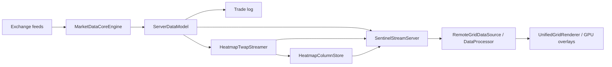

Sentinel re-entry review — September 4, 2026

The most useful next milestone is reliable historical browsing while live collection continues. Sentinel already has exchange ingestion, server aggregation, heatmap persistence, a history protocol, and GPU rendering. The missing connection is a client data model that can load older time/price ranges independently of the live texture ring.

This review expands the original brief into four questions: what already works, what prevents unattended collection, why larger charts remain difficult, and what footprint/TPO need before they are usable. It is a source review with focused executable checks, not a live deployment or performance benchmark. HEAD was `5094c7d`; the most recent commits are May 8, 2026. Existing uncommitted changes were present when the review began.

The current path is:

| Area | What is present | What remains |
| --- | --- | --- |
| Collection | Exchange transport, order book, trade stream; default symbols remain subscribed without a client | Unattended operation needs explicit lifecycle, retention, durability, and queue bounds |
| Heatmap storage | Day files, slot addressing, payload CRCs, exclusive writer lock, startup loading, RAM-to-disk history lookup | Disabled in checked-in config; active timeframe only; client cannot insert older history correctly |
| Rendering | Single-quad heatmap, GPU text, overlay modules, common time/price mapping | Separate stored history from the live ring and handle historical price bands |
| Footprint | Trade-based delta aggregation, q16 transport, GPU overlay | Separate buy/sell quantities, numerical scale retention, durable queryable history, display modes |
| TPO | Session logic, letter transport, two display layouts, POC/VAH/VAL, candle-assisted bootstrap | Session boundary bugs, consistent live/history occupancy, focused integration tests |

Footprint, TPO, and volume-profile toolbar buttons are deliberately disabled as “Coming Soon” in [TopToolbar.cpp](/Users/copeharder/Programming/Sentinel/libs/gui/widgets/TopToolbar.cpp:68). Their presence in the backend does not mean the features are finished.

**Findings that affect the proposed work**

1. **Older heatmap history is sent into a path that rejects it. Confirmed by a source-built probe.** The GUI iterates history columns through `ingestHeatmapColumn`, the same path used for live arrivals. `HeatmapStreamState::ingestSlice` returns immediately when the incoming timestamp precedes the latest timestamp. In a four-column probe, ingesting time 120000 and then time 60000 left one filled column and zero pending uploads from the older arrival. Thus a successful history response does not establish working scrollback once live data exists. The service also updates shared price-range metadata before that rejection, so a response from another historical band can affect mapping without inserting its data. See [history dispatch](/Users/copeharder/Programming/Sentinel/libs/gui/UnifiedGridRenderer.Init.cpp:148), [timestamp rejection](/Users/copeharder/Programming/Sentinel/libs/gui/render/HeatmapStreamState.cpp:84), and [range update](/Users/copeharder/Programming/Sentinel/libs/gui/render/HeatmapStreamService.cpp:161).

2. **Connection cleanup and queue bounds need attention before continuous service. High-confidence source finding; no soak test performed.** Session signal callbacks capture a strong `shared_ptr` to their Session. Signal disconnection happens in the Session destructor, but those callbacks themselves keep the Session alive. `fail()` only unregisters the latency sender and logs the error. The outgoing vector has no byte/message limit; a failed write returns without draining it. These paths can retain disconnected clients and continue accumulating outgoing data. Implement one idempotent close path, disconnect callbacks explicitly, use weak ownership where appropriate, serialize Session state on its executor, and enforce a byte budget. See [callback ownership](/Users/copeharder/Programming/Sentinel/libs/core/protocol/SentinelStreamServer.cpp:934), [destructor](/Users/copeharder/Programming/Sentinel/libs/core/protocol/SentinelStreamServer.cpp:867), and [write/error handling](/Users/copeharder/Programming/Sentinel/libs/core/protocol/SentinelStreamServer.cpp:1796). Qt documents the lifetime of these connections in [QObject::connect](https://doc.qt.io/qt-6/qobject.html#connect).

3. **Persistence exists, but the durability and operating defaults need clarification. Confirmed in source.** `persistence_enabled` defaults to false and is absent from the checked-in server YAML. Retention defaults to unlimited and only executes during startup. Day writers are retained in a map until destruction, so long uptime also accumulates open day files. Settings named `fsyncEvery*` invoke `std::fstream::flush()`, with the time threshold checked only on append. That is not an OS synchronization operation or an independently scheduled durability deadline. Ordinary process restart recovery is useful, but it does not demonstrate power-loss durability. See [defaults](/Users/copeharder/Programming/Sentinel/libs/core/config/ConfigTypes.hpp:29), [flush implementation](/Users/copeharder/Programming/Sentinel/libs/core/servermodel/HeatmapColumnStore.cpp:224), and [startup retention](/Users/copeharder/Programming/Sentinel/libs/core/servermodel/HeatmapTwapStreamer.cpp:65). Platform durability semantics should follow the intended guarantee; Apple's [fsync documentation](https://developer.apple.com/library/archive/documentation/System/Conceptual/ManPages_iPhoneOS/man2/fsync.2.html) distinguishes synchronization and storage-cache behavior.

4. **History work can block service to other clients. Confirmed execution path; latency impact unmeasured.** TPO history performs synchronous Coinbase requests from the WebSocket read handler. Heatmap history does disk lookup, allocation, base64 conversion, and JSON assembly there too. The server runs its I/O context on one thread. TPO/footprint history additionally scan the retained trade deque separately for each requested bucket; live overlays are built per Session even when their toolbar controls are disabled. Use a bounded history worker pool with cancellation/deadlines, and aggregate once per symbol/configuration for reuse by clients. Replace repeated tape scans with an ordered range lookup and one pass over the requested interval. See [TPO bootstrap](/Users/copeharder/Programming/Sentinel/libs/core/protocol/SentinelStreamServer.cpp:714), [REST loop](/Users/copeharder/Programming/Sentinel/libs/core/protocol/SentinelStreamServer.cpp:469), [synchronous HTTP](/Users/copeharder/Programming/Sentinel/libs/core/marketdata/rest/CoinbaseRestClient.cpp:128), and [trade lookup](/Users/copeharder/Programming/Sentinel/libs/core/servermodel/ServerDataModel.cpp:187).

5. **Footprint needs richer data, not just additional drawing modes. Confirmed in source.** The server transmits buy volume minus sell volume per price row, normalized to q16 with a per-column scale. The GUI staging path does not preserve that scale. Delta alone cannot recover separate buy/sell amounts: 10 buys minus 8 sells and 100 buys minus 98 sells both yield +2. Persist and stream the separate numeric quantities, deriving delta and color from them. History currently reads an in-memory tape capped at 24 hours, not the existing on-disk trade logs. A restart therefore loses the current footprint query source. See [delta construction](/Users/copeharder/Programming/Sentinel/libs/core/protocol/SentinelStreamServer.cpp:339), [GUI staging](/Users/copeharder/Programming/Sentinel/libs/gui/render/DataProcessor.cpp:206), and [retention](/Users/copeharder/Programming/Sentinel/libs/core/servermodel/ServerDataModel.cpp:94).

6. **TPO has reproducible session errors and inconsistent history semantics.** Source-built probes for September 6, 2026 show W1 at Sunday 10:00 UTC returning a session opening 11 hours in the future; Australia at Sunday 23:00 UTC returns a session that ended 16 hours earlier. Separately, W1 is defined as five days, and geographic sessions use fixed UTC offsets. Decide explicitly whether those are intended crypto sessions before extending them. Live TPO marks rows with observed trades, whereas bootstrap also fills every row between each minute candle's high and low. Those procedures can disagree across gaps. A partially populated live update can overwrite a richer bootstrap column. Define one occupancy convention and distinguish recorded coverage from approximation. See [SessionManager](/Users/copeharder/Programming/Sentinel/libs/core/servermodel/SessionManager.hpp:95), [occupancy builders](/Users/copeharder/Programming/Sentinel/libs/core/protocol/SentinelStreamServer.cpp:420), and [column replacement](/Users/copeharder/Programming/Sentinel/libs/gui/render/TpoStreamState.cpp:195). Coinbase's [candle response](https://docs.cdp.coinbase.com/api-reference/advanced-trade-api/rest-api/public/get-public-product-candles) supplies OHLCV summaries, not the sequence of traded price levels.

**How the larger canvas should work**

Treat timestamps and prices as the permanent address of the data. Keep a bounded CPU cache of requested chunks and a bounded GPU working set for the viewport plus a small margin. Panning changes which chunks are resident. Zooming out requests coarser aggregates once multiple source cells would occupy one screen pixel. Keep the existing GPU overlay approach and central mapping contract.

Each chunk needs symbol, layer, time interval, price origin/step, resolution, version, and coverage information. Requests need identifiers so stale responses from an earlier symbol, timeframe, or viewport cannot replace the current view. Carry `oldest_available_ms` through to the GUI and stop fetching at the history floor. Keep live ingestion independent from the historical window being viewed.

Time coverage and price coverage are separate. Today's persisted columns already describe their own price band, but the client treats the ring as having one shared band. Rendering older bands needs projection into the current visible price range. Widening the viewport cannot recover prices that were never recorded. `TickBinaryLogger::logBookUpdate` exists but has no call site in the inspected application, so the raw trade log is not a complete historical order-book archive. Full reconstruction would require book snapshots, ordered deltas, and explicit gap/reconnect records.

For rollups, retain numeric quantities and sufficient aggregation state, including observation duration for TWAP. Averaging already normalized color values would change the financial meaning. Volume sums, price-time occupancy, and resting-liquidity TWAP each require their own aggregation rule.

With 2,048 rows and both u16 intensity and liquidity, the current format is about 11.33 MiB/day per symbol at one-minute resolution, or 4.34 decimal GB/year. At one-second resolution it is about 679.61 MiB/day, or 260.11 GB/year. These are format calculations including record headers for a full day, excluding raw tape, indexes, backups, and compression. The checked-in timeframe list starts at one second; with no explicit active timeframe, the streamer selects that first entry. Explicitly select the collection resolution before enabling persistence.

**Suggested order of work**

1. Establish a reproducible build and close the confirmed server lifecycle/durability gaps. Run bounded reconnect, slow-client, restart, and date-rollover checks before unattended hosting. Choose collected symbols and retention deliberately; default symbols already remain subscribed without a GUI.
2. Deliver one complete history slice: one symbol, one-minute heatmap, preserved price bands, a separate client history cache, bounded GPU paging, and a visible distinction between missing data and recorded data. Acceptance: collect, restart, open yesterday, pan across a recenter boundary, and return to live without timestamp/price drift or growing memory.
3. Finish footprint for one timeframe with separate buy/sell quantities, durable history, batched numbers, and replay comparisons. Then add display options.
4. Finish TPO for an explicit 24-hour UTC session with a fixed bucket duration and matching live/replay results. Add weekly and geographic sessions after their boundary rules are tested.
5. Add time/price rollups and tune measured bottlenecks. Initial candidates are repeated per-client aggregation, synchronous history work, text formatting/geometry during pan, and large JSON/base64 history responses. There are no measured FPS or throughput improvements from this review.

**Validation and workspace effects**

The four existing test executables passed: 16 format tests, 26 column-store tests, 25 time-axis tests, and 3 frame-math tests, 70 cases total. These were pre-existing binaries. A fresh targeted build triggered CMake/vcpkg dependency reconciliation; it was interrupted after changing part of the generated dependency installation. Fresh full-build compatibility remains unverified, and a later normal build must complete or restore that dependency installation. The source-built isolated probe independently demonstrated the older-history rejection and both session-boundary issues.

No application/configuration code was changed and no live server or GUI was started. This review document and durable failure-mode notes were added. Existing user modifications were left intact. The TODO list was not rewritten: recommendations above remain proposed work, and its “scroll-past-cache fetch” completion should be interpreted as request wiring rather than verified historical rendering.

**Implementation follow-up — September 4, 2026**

The owner authorized execution after this review. The macOS dependency repair completed, the full source tree builds, and all configured tests pass. Server lifecycle and one-minute durability fixes landed first. The heatmap client now uses a separate bounded history-page path with request-boundary and symbol checks, worker-side gap filling and price-band resampling, a linear GPU-ring replacement, history-floor suppression, and return-to-live reload. Protocol pages are capped at 1,024 columns to remain below the per-session write budget. A live multi-day visual soak, distinct coverage shading, server history workers, footprint, TPO, and overview rollups remain open.
